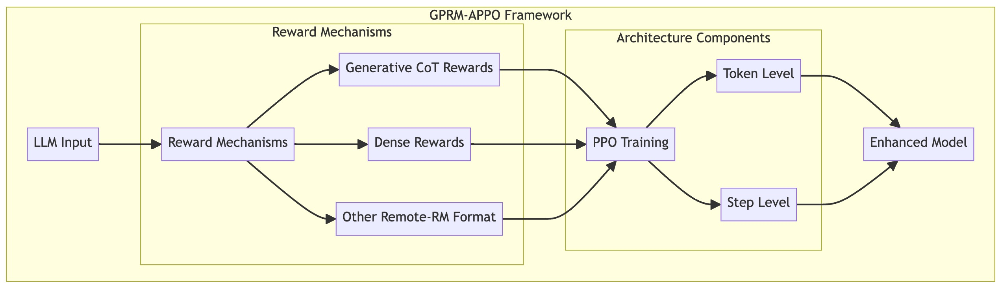

# GPRM-APPO: Action-Level PPO Reinforcement Learning Framework with Generative and Dense Rewards

## Introduction

GPRM-APPO is an enhanced reinforcement learning framework that focuses on incorporating both Generative Rewards and Dense Rewards into PPO (Proximal Policy Optimization) training. This project provides a flexible and efficient training environment specifically designed for reinforcement learning with large language models.



## Key Features

### Innovative Reward Mechanisms
- Support for both Chain-of-Thought (CoT) generative reward models and dense reward models
- Demonstrated superior generalization capabilities of CoT generative rewards in training
- Flexible reward model architecture supporting various reward computation methods

### Flexible Architecture Design
- Unified Remote-RM return format, fully compatible with PRM and ORM training pipelines and easy extension to rule-based methods
- Support for KL divergence and advantage computation at both token and step levels

### Usage Example
1. Configure training parameters
2. Run the training script:
```bash
sh examples/scripts/train_prm_ppo_qwen_72b.sh
```

## Experimental Results
TODO: Add experimental results and performance evaluation

## Future Work
We are actively exploring the effectiveness of RL in domains with ambiguous reward signals
